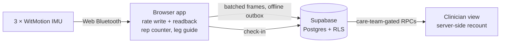

# MOVA

<p align="center">
  
</p>

<p align="left">
  <a href="https://nextjs.org/">
    
  </a>
  <a href="https://supabase.com/">
    
  </a>
  <a href="https://www.typescriptlang.org/">
    
  </a>
</p>

MOVA is a rehabilitation app for patients after primary total knee arthroplasty (TKA). It measures knee movement
with three wearable IMUs (WitMotion, on the thigh, shank and foot) connected straight to the browser over Bluetooth,
and it is built to a clinical technical specification (НТЗ) written by an orthopaedic surgeon, plus a scoring
specification for eight exercises.

**Start with [`SUBMISSION.md`](SUBMISSION.md)**: what is built, what is real, what is deliberately not claimed, and what
has not been verified. The hardware protocol is [`HARDWARE-TEST.md`](HARDWARE-TEST.md); notes for teammates are in
[`HANDOFF.md`](HANDOFF.md).

## What works today

- **Heel Slide, end to end.** A patient sees the exercise on Today, connects three sensors, does ten repetitions while
  the count and a drawing of the leg follow the movement, answers a check-in, and a clinician opens that session. The
  runbook is [`docs/heel-slide-path.md`](docs/heel-slide-path.md); the recording is
  [`docs/walkthrough/heel-slide-walkthrough-1920.mp4`](docs/walkthrough/heel-slide-walkthrough-1920.mp4).
- **Sensor rate configuration.** The app writes the output rate to the sensor and reads it back, instead of leaving
  it at the default.
- **Exercise library** at `/exercises`: the twelve exercises from the НТЗ and the scoring spec, with the
  clinician-recorded reference videos on the seven exercises a clip is confirmed to show
  ([screenshots](docs/exercise-library/)).

What it does not do, stated in full in `SUBMISSION.md`:

- **No knee angle in degrees.** The sensors give a relative orientation reading that is not calibrated to the knee,
  so the patient screen shows no number and the clinician chart says what the reading is.
- **No scores.** The scoring engine for the eight exercises is in `services/frontend/src/lib/scoring` with its tests,
  but no screen uses it yet.
- **Not run on physical sensors.** The recording uses a simulated sensor transport that exists only in local
  development and is marked «Симуляция» on screen.

## Architecture



- `services/frontend` — the Next.js 14 app (App Router, TypeScript, Tailwind): patient app, clinician portal, library.
  - `src/lib/ble` — Bluetooth client, sensor roles, rate register, session recorder, dev-only simulation.
  - `src/lib/telemetry` — frame buffer, durable queue and outbox.
  - `src/lib/motion` — repetition logic and the leg-guide geometry.
  - `src/lib/scoring` — the scoring engine (not wired to a screen).
  - `src/lib/exercises` — the static exercise catalogue; videos in `public/exercises`.
- `supabase/migrations` — the database schema, row-level security and RPCs; `supabase/tests` — SQL tests.
- `docs` — the IA ([`docs/ia.md`](docs/ia.md)), the runbook, the walkthrough and research notes.

Everything else in the repository (`services/api`, the Python `src` and ML tooling, `benchmark`, `data_manifests`,
most of `docs`, and the camera session screens still in the frontend) belongs to the earlier camera-based prototype
for Parkinson's disease and stroke (June–August 2026). It is kept for reference and is not the current product;
figures in its documents were that prototype's design targets, not measurements of this app.

## Running it

The app uses the hosted Supabase project. **Nothing needs to be installed for the database**: no Supabase CLI, no
Docker, no local Supabase. You need Node.js 20+ and network access to `*.supabase.co`.

```bash
cd services/frontend
npm ci
```

Create `services/frontend/.env.local` (git-ignored) with the project's public values:

```bash
NEXT_PUBLIC_SUPABASE_URL=<project URL>
NEXT_PUBLIC_SUPABASE_ANON_KEY=<anon public key>
```

| Variable | Needed for |
|---|---|
| `NEXT_PUBLIC_SUPABASE_URL`, `NEXT_PUBLIC_SUPABASE_ANON_KEY` | The app. Required. |
| `SUPABASE_SERVICE_ROLE_KEY` | Only `npm run seed:heel-slide`. Server-side only; bypasses row-level security. |
| `NEXT_PUBLIC_SITE_URL` | The public origin behind a proxy, for sign-in redirects. |
| `NEXT_PUBLIC_SENSOR_SIMULATION=1` | Simulated sensors, and only under `next dev`. A production build contains no simulator. |
| `HEEL_SLIDE_PATIENT_PASSWORD`, `HEEL_SLIDE_CLINICIAN_PASSWORD` | The test sign-in buttons, shown only under `next dev` and on Vercel previews. |

Run it:

```bash
npx next dev            # development, http://localhost:3000
npx next build && npx next start -p 3000   # production build
```

`npm run dev` is mapped to `next start`, so use `npx next dev` for development. A production build shows only
Google and e-mail link sign-in; the password form and test buttons for the `@mova.test` accounts exist only in
development and on Vercel previews. Web Bluetooth needs Chrome or Edge on desktop or Android; Safari and iOS do not
have it.

### Checks

```bash
npx tsc --noEmit
npm run test:unit     # node:test — everything except BLE, telemetry and scoring
npm test              # vitest — BLE, telemetry and scoring
npm run i18n:check    # ru and en keys match; kk is a subset
npx next build
```

## Database

Migrations `0001`–`0023` and `0034`–`0036` are applied to the hosted project. `0024`–`0033` are unused here on
purpose: other branches use those numbers. `0037`–`0040` are in the repository but **not applied**; `0038` and `0040`
say in their headers what to resolve first. Do not run `supabase db push` against the hosted project until those are
decided.

- `0035` closed a hole where anyone could sign up as an administrator.
- `0036` closed a hole where any account in the shared self-serve clinic, patients included, could list every
  patient in it through the clinician-portal functions. Each new signup now gets its own clinic, and portal reads
  require a platform admin, the patient's clinic admin, or an active care-team link.

## Deployment

The app deploys to Vercel from `services/frontend`; see [`docs/DEPLOYMENT.md`](docs/DEPLOYMENT.md). Vercel rejects a
deployment whose commit author e-mail is not a member of the Vercel team.

## License

MOVA is intended to be released under the MIT License. There is no `LICENSE` file in the repository yet.

## Author

**Kassymzhomart Shubay**
Nazarbayev University
