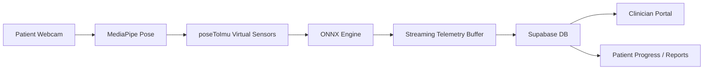

# MOVA

<p align="center">
  
</p>

<p align="left">
  <a href="#license">
    
  </a>
  <a href="https://nextjs.org/">
    
  </a>
  <a href="https://supabase.com/">
    
  </a>
  <a href="https://onnxruntime.ai/">
    
  </a>
  <a href="https://www.typescriptlang.org/">
    
  </a>
  <a href="#contributing">
    
  </a>
</p>

**MOVA** is an edge-AI tele-rehabilitation platform for Parkinson's disease and stroke recovery.
It pairs a Next.js patient and clinician experience with on-device pose estimation, browser-native
ONNX inference, and Supabase-backed clinical workflows so rehabilitation can be measured in real time
without compromising privacy.

> Camera-optional, privacy absolute.

It is designed to stream kinematics at **50 Hz**, compute clinically meaningful feedback on the patient
device, and preserve only the minimum telemetry needed for treatment, review, and outcomes reporting.
That makes MOVA suitable for home rehabilitation, low-connectivity settings, and privacy-sensitive care
models where raw video should never leave the client.

## Table of Contents

- [Project Overview](#project-overview)
- [Core Features](#core-features)
- [System Architecture](#system-architecture)
- [Getting Started](#getting-started)
- [Environment Setup & Deployment](#environment-setup--deployment)
- [Gamification Ecosystem](#gamification-ecosystem)
- [Contributing](#contributing)
- [License](#license)
- [Author](#author)
- [Further Reading](#further-reading)

## Project Overview

MOVA is built to bring motion intelligence out of the lab and into the patient's daily environment.
Its operating premise is simple: if the model can understand movement on-device, the platform can
deliver feedback, scoring, and progression in the same session in which therapy happens.

The result is a rehabilitation stack that is:

- **Camera-optional**: the system can operate with webcam-guided pose, IMU-assisted sensing, or both.
- **Privacy absolute**: raw video stays on the patient device; only derived pose, telemetry, and session
  artifacts are persisted.
- **Clinically legible**: kinematic signals are translated into ROM trends, freezing-of-gait indicators,
  adherence measures, and clinician-facing summaries.
- **Real-time by design**: the browser computes and buffers telemetry at a fixed **50 Hz**, giving the
  downstream models a stable stream for inference and reporting.

This repository combines the public-facing product surfaces, Supabase schema and security layer, motion
telemetry contracts, and the supporting research documentation that grounds the system in rehabilitation
and human motion science.

## Core Features

| Surface | What it does | Clinical value |
|---|---|---|
| Patient App | Rhythmic stepping gamification, real-time FoG scoring, CV-guided ROM baseline capture, and the `SessionInsightsCoach` session analysis layer. | Keeps therapy engaging while quantifying gait quality and range-of-motion in-session. |
| Clinician Portal | Secure mock FHIR data, real-time patient progression tracking, prescription editor, and PDF outcome reports. | Lets clinicians review progress, adjust programs, and export evidence-ready summaries. |
| On-Device Motion Stack | MediaPipe pose estimation, `poseToImu` virtual sensors, and ONNX Runtime Web inference. | Maintains privacy while producing low-latency movement telemetry in the browser. |
| Supabase Core | Auth, RLS, Edge Functions, typed RPCs, and clinic-scoped storage. | Keeps patient data isolated and auditable while supporting a fast product workflow. |

## System Architecture



The architecture keeps the inference path close to the user. Pose estimation and the first stage of
kinematic derivation happen in the browser; telemetry is normalized into a stable stream; and only then
does it reach the persistence and clinician review layer in Supabase.

## Getting Started

### Prerequisites

Before you start, install:

- Node.js 18+ or 20+
- npm
- Supabase CLI

If you plan to run the local backend stack, also make sure Docker is available for the Supabase tooling.

### Installation

```bash
git clone <your-repo-url>
cd mova
cd services/frontend
npm install
```

### Model Sync

The frontend expects browser-ready ML assets to be present before the session experience is used.
Sync them with:

```bash
npm run models:sync
```

### Environment Variables

The web app reads its configuration from `services/frontend/.env.local`. See
[Environment Setup & Deployment](#environment-setup--deployment) for the full template and the list of
required keys. The root [.env.example](.env.example) documents optional backend and deployment variables.

### Run the App

```bash
npm run dev
```

The frontend runs at http://localhost:3000.

### Optional Local Supabase

If you want the database and auth layer running locally as well, use the Supabase project in the repo root:

```bash
supabase start
```

## Environment Setup & Deployment

### `.env.local` template

The web app reads its runtime configuration from `services/frontend/.env.local`. Create the file and
populate it with the values from **your own** Supabase project (Project Settings → API). Never commit
real keys — `.env.local` is git-ignored, and only placeholders belong in this document.

```bash
# services/frontend/.env.local

# Public — safe to expose to the browser
NEXT_PUBLIC_SUPABASE_URL=<YOUR_SUPABASE_URL>
NEXT_PUBLIC_SUPABASE_ANON_KEY=<YOUR_SUPABASE_ANON_KEY>

# Server-only — bypasses Row-Level Security, must never reach the client
SUPABASE_SERVICE_ROLE_KEY=<YOUR_SUPABASE_SERVICE_ROLE_KEY>
```

| Variable | Scope | Where to find it |
|---|---|---|
| `NEXT_PUBLIC_SUPABASE_URL` | Public | Supabase → Project Settings → API → Project URL |
| `NEXT_PUBLIC_SUPABASE_ANON_KEY` | Public | Supabase → Project Settings → API → `anon` public key |
| `SUPABASE_SERVICE_ROLE_KEY` | Server only | Supabase → Project Settings → API → `service_role` key |

> ⚠️ The `service_role` key has full database privileges and bypasses RLS. Keep it server-side only and
> never expose it through a `NEXT_PUBLIC_*` variable.

### Database migrations (Supabase CLI)

To run database migrations locally, install the [Supabase CLI](https://supabase.com/docs/guides/cli),
authenticate, and link this project:

```bash
supabase login
supabase link --project-ref sbdtujkpklqyevaoxfph
supabase db push   # apply the local migrations to the linked project
```

### Deployment (Render)

The repository ships a [`render.yaml`](render.yaml) Blueprint at the root that provisions both services
as a microarchitecture:

- **`mova-api`** — the Python inference backend (`services/api`), built from its Dockerfile.
- **`mova-frontend`** — the Next.js web app (`services/frontend`), `npm ci && npm run build` → `npm start`.

Create a new **Blueprint** in the Render dashboard pointed at this repo, then set the three Supabase
variables above on the `mova-frontend` service (they are declared with `sync: false`, so Render prompts
for them and they stay out of version control).

## Gamification Ecosystem

MOVA's gamification layer is not decorative. It is part of the clinical workflow and is implemented so
that patient-facing rewards remain consistent with the database rules.

XP, streaks, and badges are managed through `SECURITY DEFINER` RPCs in Supabase. That means the database
executes the reward logic with controlled privileges, validates the caller's identity and clinic scope,
and writes only the approved rows to `xp_ledger`, `streaks`, and related tables. The client never gets
direct write access to the reward tables; it can only invoke narrow, audited functions.

This design keeps the reward system secure, deterministic, and easy to reason about while still allowing
the patient app to show immediate feedback after a completed session.

## Contributing

Contributions are welcome, especially from developers, clinicians, and researchers who want to improve
motion telemetry, rehabilitation UX, or the surrounding documentation.

Please keep pull requests focused and include verification for any code or schema changes. Good starting
areas include:

- Patient and clinician UI improvements
- Supabase schema, RLS, or RPC hardening
- ONNX / MediaPipe inference improvements
- Documentation, benchmarks, and research references

If you are opening a substantial change, describe the clinical or product behavior it affects and include
the validation steps you ran locally.

## License

MOVA is intended to be released under the MIT License.

If you are publishing the repository, add a root-level `LICENSE` file with the MIT text so the badge and
the source-of-truth license file stay aligned.

## Author

**Kassymzhomart Shubay**  
Nazarbayev University

## Further Reading

- [MOVA Master Document](docs/MOVA_MASTER_DOCUMENT.md)
- [System & Training Architecture](docs/03_architecture.md)
- [Product Master Plan](docs/04_product_master_plan.md)
- [Thesis Proposal](docs/00_thesis_proposal.md)
- [Dataset Guide](docs/01_datasets.md)
- [Reading List](docs/02_reading_list.md)
