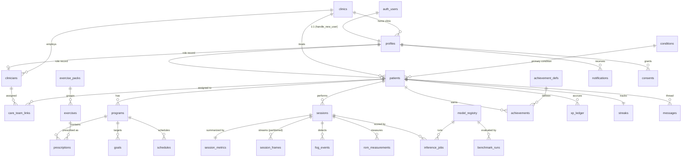

# Phase 1 — Entity-relationship description

The Supabase schema ([`supabase/migrations/`](../supabase/migrations/)). `clinics` is the
tenant; `auth.users` (Supabase-managed) is the identity root; `profiles` extends it 1:1.
Every per-patient row carries a denormalized `clinic_id` for fast, tenant-isolated RLS.

## Diagram (core)

## Groups

**Identity & tenancy** — `clinics` (tenant) · `profiles` (1:1 with `auth.users`, holds `role`
+ home `clinic_id`) · `clinicians` / `patients` (role records) · `care_team_links`
(clinician↔patient assignment — the hinge of clinician RLS) · `conditions` (catalog).

**Programs** — `exercise_packs` → `exercises` (catalogs) · per-patient `programs` containing
`prescriptions`, `goals`, and `schedules`.

**Sessions & outcomes** — `sessions` → `session_metrics` (1:1 aggregate), `session_frames`
(high-volume per-frame time-series, range-partitioned by `recorded_at`), `fog_events`,
`rom_measurements`. Frames store **derived** keypoints/metrics only.

**Gamification** — `achievement_defs` (catalog) → `achievements` (earned) · `xp_ledger`
(append-only) · `streaks` (1:1).

**Communications** — `messages` (per-patient care-team thread) · `notifications` (per user) ·
`consents` (compliance record).

**Content & registry** — `content` (papers/model-cards/dataset-cards/docs) · `citations`
(BibTeX; fulfils Part 6 `references`) · `model_registry` · `benchmark_runs` (leaderboard).

**Contract & audit** — `inference_jobs` (typed Supabase↔Python handoff) · `audit_log`
(append-only, written only by the `app.audit_row()` trigger).

## Conventions

- **PKs** are `uuid` (`gen_random_uuid()`), except `audit_log` (identity bigint) and catalog
  keys (`achievement_defs.code`, `conditions.slug`).
- **Timestamps**: `created_at` / `updated_at` everywhere; `updated_at` maintained by the
  `app.touch_updated_at()` trigger.
- **Enums** (migration `0002`) encode the body-site ontology, modalities, statuses, and the
  inference task/status domains.
- **Partitioning**: `session_frames` uses native declarative range partitioning; a default
  partition plus on-demand monthly partitions via `app.ensure_session_frames_partition(date)`.
  Promote the default to a Timescale hypertable where the extension is available.
